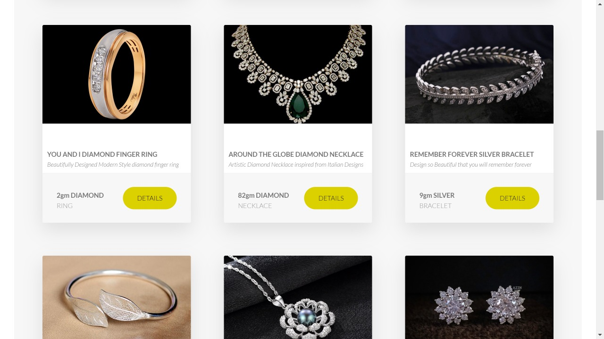

<h1 align="center">
  <br>
  </a>
  <br>
  Rajendra Jewelry
  <br>
</h1>

<h4 align="center">An awesome jewelry store site built on top of <a href="https://nodejs.org/en/" target="_blank">NodeJS</a>.</h4>

 <p align="center">
  <a href="#key-features">Key Features</a> •
  <a href="#how-to-use">How To Use</a> •
  <a href="#installation">Installation</a> • 
</p>

## Key Features

- Authentication and Authorization
  - Login and logout
- Jewelry
  - Buy Jewelry
- Admin Profile
  - Manage products, see orders and users
- User profile
  - Update username, photo, email, and password
- Credit card Payment

## Screenshots





## How To Use

### Buy jewelry

- Login to the site
- Search for jewelry that you want to buy
- Proceed to the payment checkout page
- Enter the card details (Test Mood):
  ```
  - Card No. : 4242 4242 4242 4242
  - Expiry date: 02 / 24
  - CVV: 222
  ```

### Admin details

email: admin@gmail.com
password: admin1234

### Manage your booking

- Check the tour you have booked in "Manage Booking" page in your user settings. You'll be automatically redirected to this
  page after you have completed the booking.

### Update your profile

- You can update your own username, profile photo, email and password.

## Build With

- [NodeJS](https://nodejs.org/en/) - JS runtime environment
- [Express](http://expressjs.com/) - The web framework used
- [Mongoose](https://mongoosejs.com/) - Object Data Modelling (ODM) library
- [MongoDB Atlas](https://www.mongodb.com/cloud/atlas) - Cloud database service
- [Pug](https://pugjs.org/api/getting-started.html) - High performance template engine
- [JSON Web Token](https://jwt.io/) - Security token
- [Stripe](https://stripe.com/) - Online payment API
- [Postman](https://www.getpostman.com/) - API testing
- [Mailtrap](https://mailtrap.io/) & [Sendgrid](https://sendgrid.com/) - Email delivery platform
- [Heroku](https://www.heroku.com/) - Cloud platform

## Installation

You can fork the app or you can git-clone the app into your local machine. Once done that, please install all the
dependencies by running

```
$ npm i
set your env variables
$ npm run dev (for development)
$ npm run start:prod (for production)
$ npm run debug (for debug)
$ npm start
Setting up ESLint and Prettier in VS Code 👇
$ npm i eslint prettier eslint-config-prettier eslint-plugin-prettier eslint-config-airbnb eslint-plugin-node
eslint-plugin-import eslint-plugin-jsx-a11y  eslint-plugin-react --save-dev
```

## Link to the website
